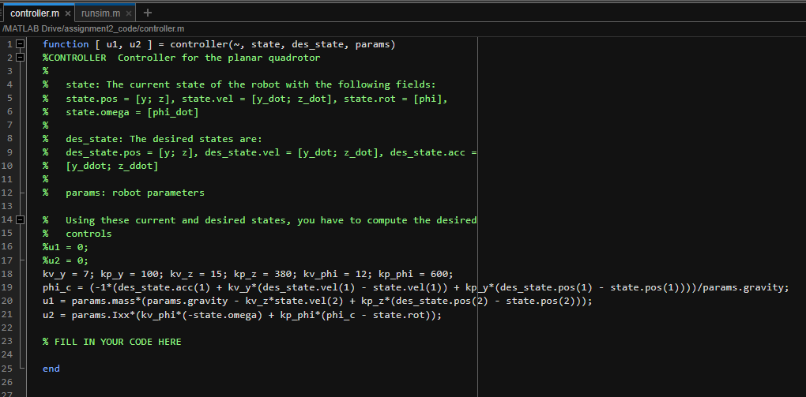
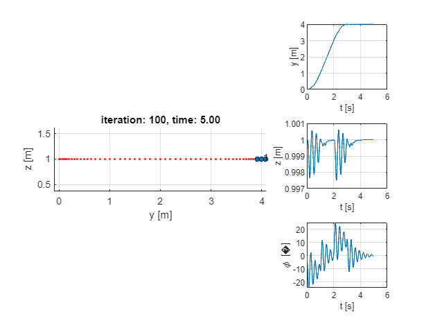
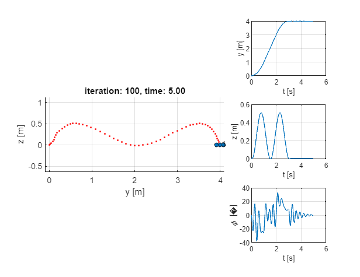
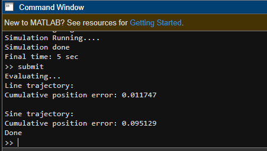

# Aerial-Robotics
This is a repo for Coursera's Aerial Robotics

This assignment was focused on obtaining linearized equation of motions for quadrotor in 2D plan (Y-Z). A simple PD controller has been used in each plant (phi, u1, u2).

The resulting equations and PD controller tuned parameters are shown below:

StraightLine trajectory output:

Sinewave trajectory output:

My position error based on PD params:

